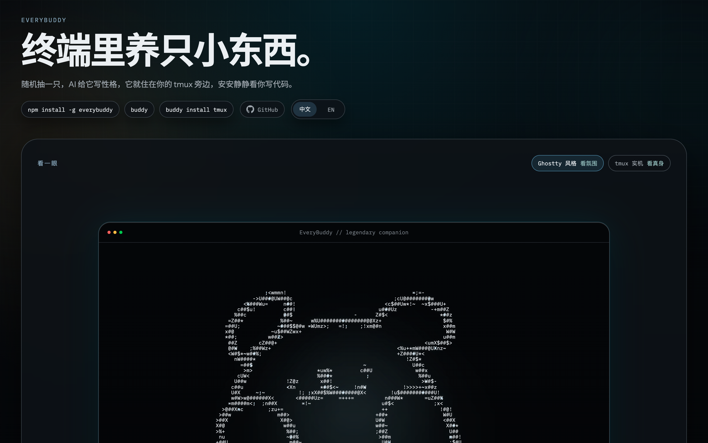
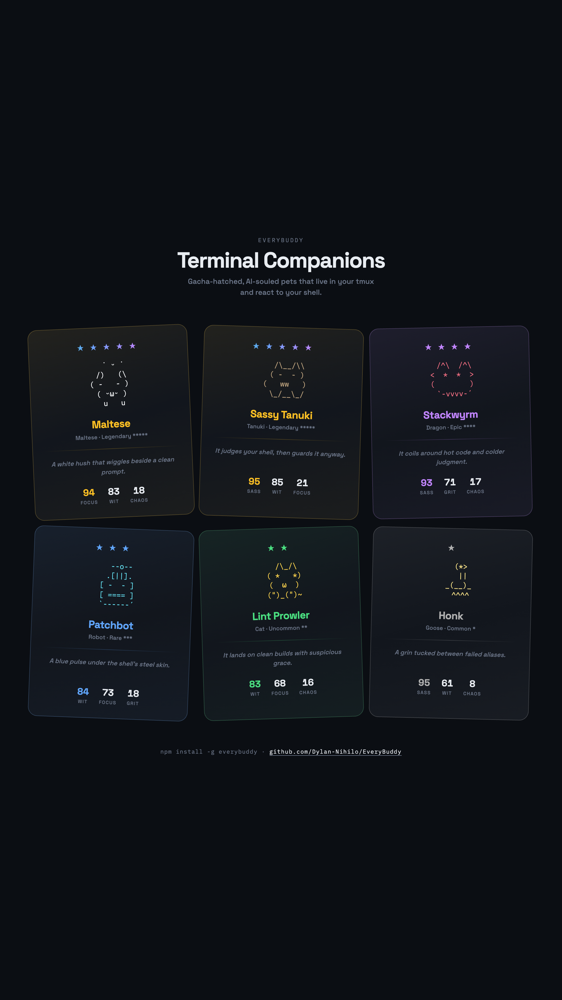
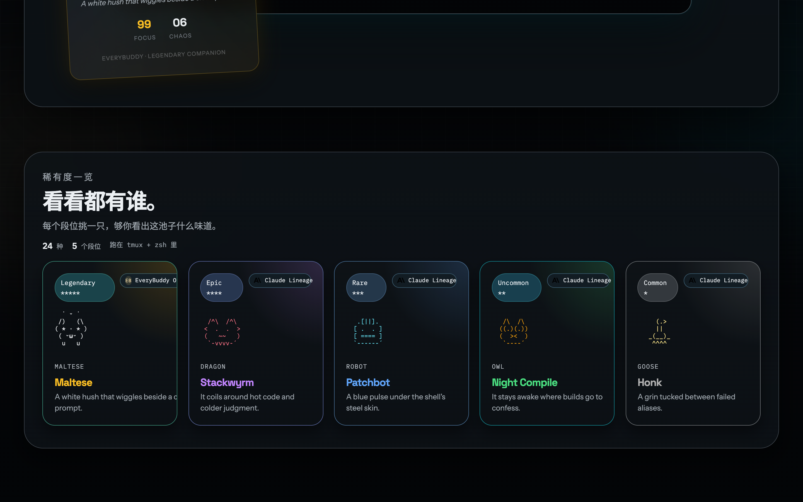

<p align="center">
  
</p>

<h1 align="center">EveryBuddy</h1>

<p align="center">
  <strong>Gacha-hatched terminal companions that live in your tmux.</strong><br>
  Draw a pet. AI writes its soul. It watches your shell and reacts.
</p>

<p align="center">
  
  
  
  
  
  
  
</p>

<p align="center">
  <a href="#quick-start">Quick Start</a> ·
  <a href="#how-it-works">How It Works</a> ·
  <a href="#rarity-tiers">Rarity</a> ·
  <a href="#commands">Commands</a> ·
  <a href="#development">Development</a>
</p>

---

## Prerequisites

- **[Node.js](https://nodejs.org/)** >= 20
- **[tmux](https://github.com/tmux/tmux/wiki)** — the companion lives here
- **zsh** — shell hooks only support zsh for now

## Quick Start

```bash
npm install -g everybuddy

buddy                    # gacha draw → soul imprint → your companion is born
buddy install tmux       # hook into zsh + tmux
```

Open a new tmux window. Your companion is there.

## How It Works

```
┌─────────────┐     ┌─────────────┐     ┌─────────────────────┐
│  1. BONES   │ ──→ │  2. SOUL    │ ──→ │  3. RUNTIME         │
│             │     │             │     │                     │
│ Deterministic     │ LLM writes  │     │ tmux sidecar pane   │
│ gacha draw  │     │ name +      │     │ observes commands   │
│ from your   │     │ personality │     │ via Unix socket,    │
│ username    │     │ + profile   │     │ reacts with speech  │
│ seed        │     │             │     │ bubbles + sprites   │
└─────────────┘     └─────────────┘     └─────────────────────┘
```

**Bones are deterministic.** Same username → same species, rarity, stats, appearance. Always. The PRNG is seeded from `hash(username + salt)` — no network, no randomness.

**Soul is AI-generated.** A single LLM call produces the companion's name, tagline, personality, and observer profile (voice, chattiness, sharpness, patience). This controls how often and how sharply the companion speaks.

**Runtime is reactive.** Shell hooks fire `buddy event <type>` on every command. The sidecar evaluates whether to call the LLM for a reaction based on the observer profile, command history, and cooldown timers.

## Companion Cards

Every companion gets a card with rarity-colored borders, animated sprites, and stat bars.

<p align="center">
  
</p>

## Gacha Animation

The hatching sequence is a 5-phase ANSI animation rendered in-place:

| Phase | What happens | Legendary | Common |
|-------|-------------|-----------|--------|
| Charge | Spinner builds tension | 1.8s | 0.8s |
| Particles | Converge to center | 1.2s | 0.5s |
| Flash | Screen bursts in rarity color | Rainbow + shake | Subtle tint |
| Silhouette | Dim outline appears | 0.5s | 0.3s |
| Reveal | Color fills, name types out | 0.7s | 0.5s |

Higher rarity = longer animation = more anticipation.

## Rarity Tiers

| | Tier | Stars | Drop Rate | Species |
|-|------|-------|-----------|---------|
| ⬜ | Common | ★ | 60% | Duck, Goose, Blob, Penguin, Turtle, Snail, Cactus |
| 🟩 | Uncommon | ★★ | 25% | Cat, Owl, Capybara, Mushroom, Frog |
| 🟦 | Rare | ★★★ | 10% | Robot, Ghost, Chonk, Heavy Loop |
| 🟪 | Epic | ★★★★ | 4% | Dragon, Octopus, Axolotl, Fox, Crystal, Jellyfish |
| 🟨 | Legendary | ★★★★★ | 1% | Maltese, Velvet Escape, Sassy Tanuki |

<p align="center">
  
</p>

## Claude Code Integration

Your companion can also live in the Claude Code status bar.

```bash
buddy install claude-code   # configures statusLine + auto-hatches
```

Or install via the [CC plugin](https://github.com/Dylan-Nihilo/everybuddy-claude-plugin):

```
/plugin marketplace add Dylan-Nihilo/everybuddy-claude-plugin
/plugin install everybuddy
/everybuddy:setup
```

## Commands

```bash
buddy                       # show your companion (or first-run setup)
buddy setup                 # reconfigure LLM provider
buddy hatch                 # re-draw a new companion
buddy hatch --force         # force replace current companion
buddy install tmux          # install shell hooks in ~/.zshrc
buddy install claude-code   # configure Claude Code status bar
buddy pet                   # view companion card
buddy pet --color           # force ANSI color output in non-TTY
```

## LLM Providers

The companion's soul imprint and sidecar reactions are powered by an LLM. Choose during `buddy setup`:

| Provider | Default Model | Notes |
|----------|---------------|-------|
| [Alibaba DashScope](https://dashscope.aliyun.com/) | `qwen3.5-plus` | Default. Free tier available. |
| [OpenAI](https://platform.openai.com/) | `gpt-4o-mini` | Needs API key. |
| [Anthropic](https://console.anthropic.com/) | `claude-haiku-4-5` | Needs API key. |
| Custom | any | Any OpenAI-compatible endpoint. |

Provider is tested on setup — if the connection fails, you get a warning but config is still saved.

## Tech Stack

| | Technology | Role |
|-|------------|------|
| 🟦 | [TypeScript](https://www.typescriptlang.org/) | Language |
| 🟩 | [Node.js](https://nodejs.org/) >= 20 | Runtime |
| 📦 | [pnpm](https://pnpm.io/) | Package manager |
| 🖥️ | [tmux](https://github.com/tmux/tmux/wiki) | Sidecar host |
| 🐚 | [zsh](https://www.zsh.org/) | Shell hooks |
| 🧪 | [node:test](https://nodejs.org/api/test.html) | Test runner (built-in, no framework) |
| 🎨 | ANSI escape codes | Terminal rendering + animation |
| 🔌 | Unix domain sockets | Shell event transport |
| 🤖 | OpenAI-compatible API | Soul imprint + observer reactions |

## Project Structure

```
src/
├── atlas/          # Bundled companion templates (deterministic draw pool)
├── bones/          # PRNG, rarity weights, stat rolling
├── cli/            # Commander commands (setup, hatch, install, event)
├── i18n/           # Chinese/English localization
├── render/
│   ├── gacha.ts    # 5-phase hatching animation
│   ├── card.ts     # Companion card renderer
│   ├── sprites.ts  # ASCII art registry (24 species × 3 frames)
│   └── compose.ts  # Sprite composition (species + eyes + hat + color)
├── runtime/
│   ├── observer.ts # LLM-powered reaction engine
│   └── sidecar.ts  # tmux pane renderer
├── soul/           # LLM providers (OpenAI-compatible, Anthropic)
├── storage/        # Config + companion persistence (~/.terminal-buddy/)
└── types/          # TypeScript interfaces

showcase/           # Product website (dark theme, glass holographic cards)
tools/              # Gallery builder, image-to-ASCII converter
```

## Development

```bash
pnpm install          # install deps
pnpm build            # tsc → dist/
pnpm test             # node --test (59 tests)
pnpm dev              # tsx src/index.ts
pnpm run typecheck    # tsc --noEmit

# test with a specific rarity
rm -rf ~/.terminal-buddy && EVERYBUDDY_USER_ID=t-69 node dist/index.js   # Legendary
rm -rf ~/.terminal-buddy && EVERYBUDDY_USER_ID=t-23 node dist/index.js   # Epic
rm -rf ~/.terminal-buddy && EVERYBUDDY_USER_ID=t-0 node dist/index.js    # Common
```

## License

MIT
